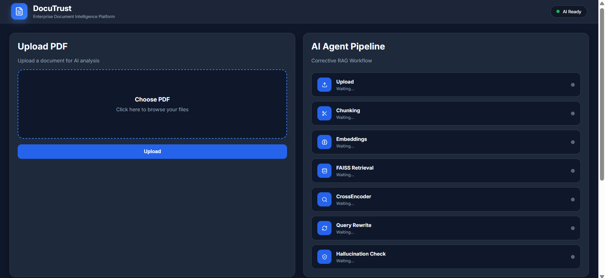

# 📄 DocuTrust – Enterprise Document Intelligence using Corrective RAG (CRAG)

DocuTrust is an AI-powered Enterprise Document Intelligence platform that enables users to upload PDF documents and ask natural language questions. The system retrieves the most relevant document chunks using FAISS, improves retrieval quality with CrossEncoder re-ranking and query rewriting, validates responses using a hallucination checker, and generates accurate answers using a Large Language Model (LLM).

---

## 🚀 Features

- 📄 PDF Upload & Text Extraction
- ✂️ Intelligent Text Chunking
- 🧠 SentenceTransformer Embeddings
- 🔍 FAISS Vector Similarity Search
- ⚡ CrossEncoder Re-ranking
- 🔄 Automatic Query Rewriting (Corrective RAG)
- 🛡️ Hallucination Detection
- 🤖 LLM-powered Answer Generation
- 📚 Source Citation Display
- 📊 Confidence Score
- 📝 MongoDB Interaction Logging
- 🌙 Modern Enterprise React Dashboard

---

## 🏗️ System Architecture

```text
                PDF Upload
                     │
                     ▼
          Text Extraction (PyPDF)
                     │
                     ▼
              Text Chunking
                     │
                     ▼
     SentenceTransformer Embeddings
                     │
                     ▼
              FAISS Vector Store
                     │
                     ▼
         Retrieve Top Relevant Chunks
                     │
                     ▼
      CrossEncoder Re-ranking
                     │
          Low Relevance?
             │          │
           Yes          No
             │
             ▼
      Query Rewriting (CRAG)
             │
             ▼
      Retrieve Again
             │
             ▼
      Build Context
             │
             ▼
        LLM (Groq Llama)
             │
             ▼
    Hallucination Checker
             │
             ▼
      Final Answer + Citations
             │
             ▼
     MongoDB Interaction Logs
```

---

## 🛠️ Tech Stack

### Frontend

- React.js
- Axios
- React Markdown
- Lucide React Icons
- CSS3

### Backend

- FastAPI
- PyPDF
- LangChain
- SentenceTransformers
- FAISS
- CrossEncoder
- Groq API (Llama)
- MongoDB Atlas

---

## 📂 Project Structure

```text
DocuTrust
│
├── backend
│   ├── services
│   │   ├── embedding_service.py
│   │   ├── hallucination_checker.py
│   │   ├── llm_service.py
│   │   ├── query_rewriter.py
│   │   ├── relevance_grader.py
│   │   ├── retriever.py
│   │   ├── text_processor.py
│   │   └── vector_store.py
│   │
│   ├── uploads
│   ├── main.py
│   ├── database.py
│   └── requirements.txt
│
├── frontend
│   ├── src
│   │   ├── components
│   │   ├── pages
│   │   ├── services
│   │   └── App.jsx
│   └── package.json
│
└── README.md
```

---

## ⚙️ Installation

### Clone Repository

```bash
git clone https://github.com/avisha191/DocuTrust.git
```

---

### Backend

```bash
cd backend

python -m venv venv

venv\Scripts\activate

pip install -r requirements.txt

uvicorn main:app --reload
```

---

### Frontend

```bash
cd frontend

npm install

npm run dev
```

---

## 🎯 Workflow

1. Upload a PDF document.
2. Extract text using PyPDF.
3. Split text into semantic chunks.
4. Generate embeddings using SentenceTransformers.
5. Store vectors in FAISS.
6. Retrieve relevant chunks for the user query.
7. Re-rank results using CrossEncoder.
8. Rewrite query if retrieval quality is low (CRAG).
9. Generate an answer using Groq Llama.
10. Verify answer using a hallucination checker.
11. Display answer with confidence score and source citations.
12. Log the interaction to MongoDB Atlas.

---

## 📸 Screenshots

### Dashboard

> 

### Upload Document

> 

### Ask Questions

> 

### Source Citations

> 

---

## 🔮 Future Improvements

- Multi-document support
- OCR support for scanned PDFs
- Role-based authentication
- Docker deployment
- Cloud storage integration
- Conversation history
- Semantic document comparison

---

## 👨‍💻 Author

**Avisha Sahu**

B.Tech CSE | VIT Bhopal University

---

## ⭐ If you found this project useful, consider giving it a star!